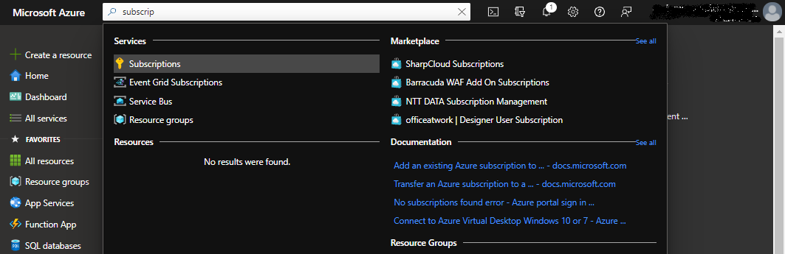
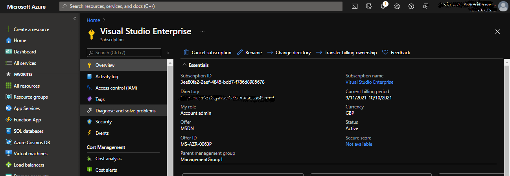
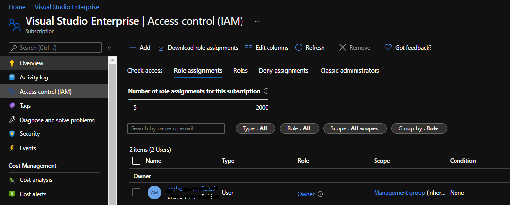
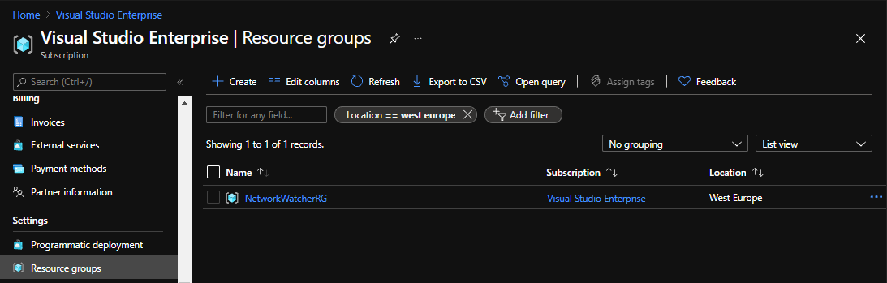
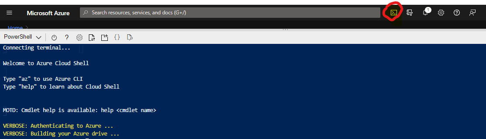

# Lesson 1: First steps with the Azure Portal

As a first step we will log into the Azure Portal and use the Azure Cloud Shell to create a virtual machine.

## View your subscription

Log into the Azure portal with your account: https://portal.azure.com

With the Azure portal, you can manage your Azure subscription using a graphical user interface. 
You can build, manage, and monitor everything from simple web apps to complex cloud deployments.

Examine your subscription by:

1. Clicking on the search bar in the portal.
2. Type 'Subscription' and select the Subscription option.
3. Select your 'Visual Studio' Azure subscription.



All items you create in Azure - be it an Azure Sql Database, an Azure Storage Account - are known as **resources** and have an associated cost.
A subscription represents the container under which resources are grouped for paying that cost.

The Azure portal is organised into **blades** depending on what item you are viewing.
Lets take a look at a few of the important items in the Subscription blade:



### Overview

The Overview page is available in the blade for any resource and will show the key information for that resource.

### Access Control (IAM)

The Access Control (IAM) page controls "Identity and Access Management" (IAM).
Azure works on the principal of "Role Based Access Management" (RBAC).
Roles are assigned to users on subcriptions and resources and determine what the user can do.

There are two important notes to make about roles:

1. There are a large number of roles but the three key roles to understand are:
   1. **Reader**: Allows users to view the resource but not modify.
   2. **Contributor**: Allows users most actions on a resource (create, modify, delete etc.) but cannot assign rights to other users.
   3. **Owner**: As Contributor but with the ability to assign rights to other users.
2. Roles are inherited. If you have a role on a subscription, then you have that role on any resource in the subscription.

Open the **Access Control (IAM)** page and select the **Role Assignments** tab:



You will see, as the creator of this subscription, that you have the **Owner** role for the subscription.

### Cost Analysis, Cost Alerts, and Budgets

The cost analysis and cost alerts and budgets allow you to monitor and control spending on resources.
We won't go into much detail now, but these are useful tools.

### Resource Groups

Resource groups are used to logically group resources together.
They are analagous to folders in a file system, except that they cannot be nested: You cannot have resource groups within resource groups.

In the subcription blade click on the **Resource Groups** item.
Unless you have already used this subscription you should find this view is empty.



**Note**: You don't need to view resource groups from the Subscription blade.
There is a dedicated **Resource Group** view from the Azure Portal main menu.

Navigate to this using the Portal search menu.

## The Azure Cloud Shell and CLI

The Azure Cloud Shell allows you to interact with Azure from a command line in the browser.
To open the cloud shell click on the **Cloud Shell** icon in the portal top menu:



You will be asked to set up storage for your cloud shell: Allow the default options.

You have two main options for interacting with Azure from the command line: The Azure CLI or Azure Powershell.
We will concentrate on the Azure CLI.

The documentation for the Azure CLI can be found [here](https://docs.microsoft.com/en-us/cli/azure/?view=azure-cli-latest)

Note: When using the Azure CLI in the cloud shell you are automatically authenticated. 
Outside of the cloud shell you need to authenticate using the ```az login``` command.

Enter the following command to check that the active subscription is correct for this dojo:

```az account show --output table```

## Exercise 1

Use the Azure Cloud Shell and Azure CLI to create a resource group in your subscription:

1. The resource group will be used for a virtual machine you will use for further exercises. Give it a suitable name.
2. The resource group should be in the 'UK South' region. 
   Regions represent the physical location where the resource will reside.
3. Use the Azure CLI documentation to find the correct command.