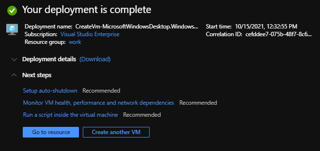

# Lesson 2: Creating Your Virtual Machine 

A virtual machine (VM) in Azure is made of three resources:

1. The virtual machine itself
2. The virtual disk
3. The virtual network interface card.

In addition, there are two related components.

1. The virtual network interface card must be connected to a virtual network (vnet), which itself is an Azure resource.
   This can be optionally created when creating the VM if one does not exist.
2. A network security group (NSG) can be connected to the network interface card or vnet to secure network access to your VM.

## Exercise: Create your VM

We are now going to create a VM using the Azure portal.

To start the VM creation process

1. In the Azure portal navigate to your newly created resource group from Lesson 1.
2. Click the **Create** button in the top menu.
3. Type **Virtual Machine** and select the option.
4. Clock the **Create** button.

Now work your way through the **Create a virtual machine** wizard to create the virtual machine. 
Use the following options and leave the rest unchanged.

### Basics

Virtual machine name: Choose a unique name
Region: UK South
Image: Windows 10 Pro, Version 20H2 - Gen2
Size: Standard_B4ms
Username/Password: Choose a unique username and password.
Public inbound ports: None

### Disks

(All defaults)

### Networking

(All defaults)

### Management

(All defaults)

### Advanced

(All defaults)

### Tags

(All defaults)

### Review + Create

Click the Create button and now wait for the Deployment to complete.
The portal will keep track of the deployment progress.



## Connecting to your VM

Click on the **Go to resource** button

This will take you to the blade for your Virtual Machine.

Connection to the VM is via a remote desktop gateway.  
We must allow access to the VM from the gateway in the Network Security Group.

In the Virtual Machine blade select **Networking**.  
Under **Inbound port rules** click on **Add inbound port rule**.  
On the **Add inbound security rule** modify the following elements:

| Field               | Value                          |
| ------------------- | ------------------------------ |
| Source              | IP Addresses                   |
| Source IP addresses | 213.143.146.159,213.143.143.68 |
| Service             | RDP                            |
| Name                | Allow_Civica_RDP               |

Click the **Add** button and wait for this to complete.  
Note that results are reported under **Notifications**.


Return to the **Overview** tab, click **Connect**, and select **RDP**:  
On the wizard click the **Download RDP File**.
Download the RDP file to a suitable folder.  
Right click the .rdp file and click **Edit**.  
Under the **Advanced** tab click the **Settings** button.  
Select **Use these RD Gateway server settings** and enter **rdg.civica.root.local**


Press **OK**, return to the General tab and click **Save** under **Connection settings**  
Now click **Connect**.  
At the first dialog (connection to the Civica RDP gateway) enter your Civica credentials and hit **OK**.  
At the second dialog enter your VM username and password.  
A further dialog may appear asking you to confirm you want to connect. Select Yes.

You are now the proud owner of a new Azure hosted VM!

## Installing software

We will use Winget to install Visual Studio Code and The Azure CLI.

Open Edge and use the following url to find the latest version of Winget:

https://github.com/microsoft/winget-cli/releases

Download the .msix file for the latest release and install.  
Open a command window and run the following commands:

```PowerShell
winget install -e --id Microsoft.VisualStudioCode --accept-source-agreements
winget install -e --id Microsoft.AzureCLI
winget install -e --id Git.Git
```

## Cloning this repository

!TODO!: Define how to clone this repository into the VM
